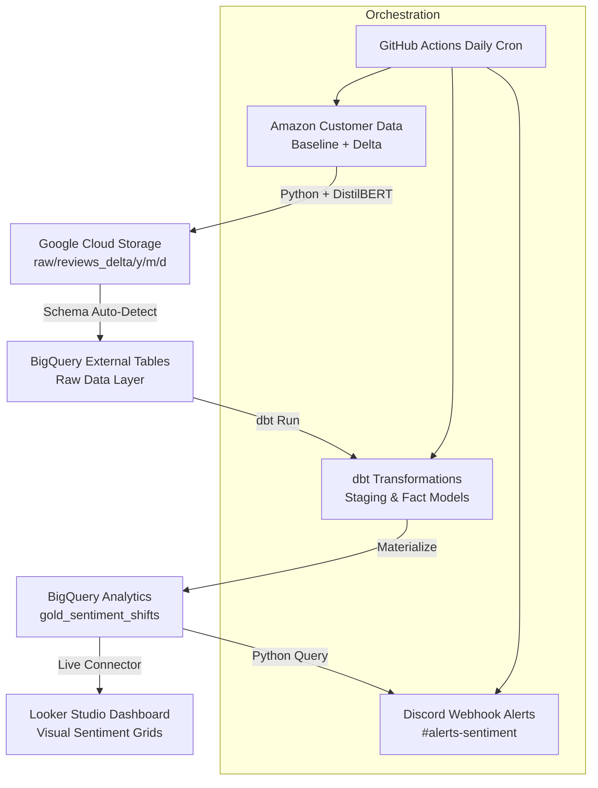
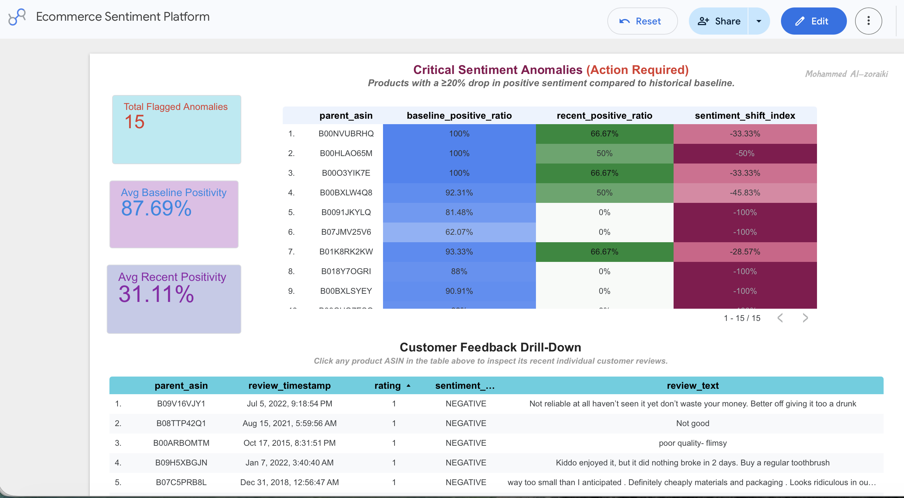
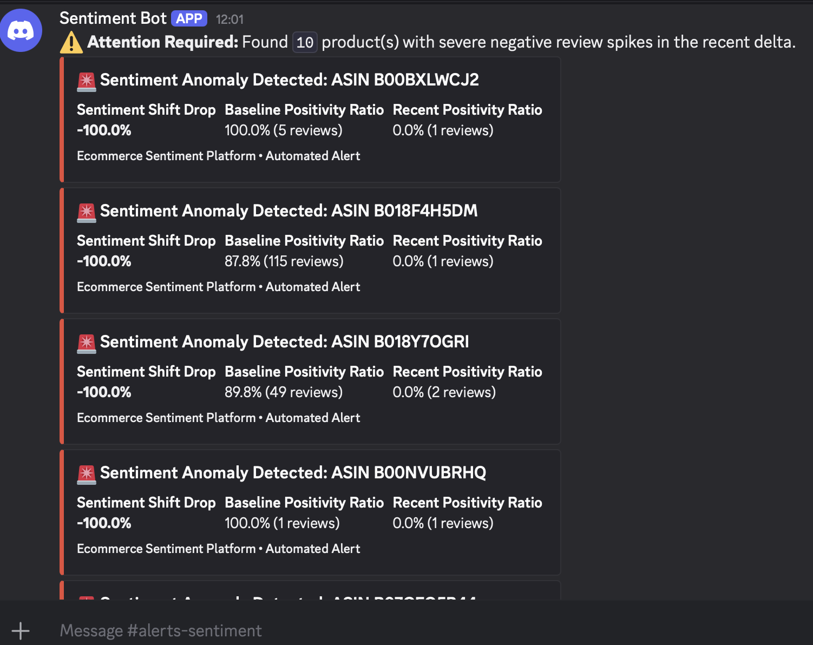

# 🛒 Real-Time E-Commerce Sentiment Intelligence & Anomaly Platform

An end-to-end production data engineering platform built on Google Cloud Platform (GCP), dbt, and HuggingFace DistilBERT. The system automates daily review ingestion, runs ML sentiment inference, flags negative sentiment anomalies ($\ge 20\%$ drop in positivity), dispatches automated alerts to Discord, and visualizes trends in Looker Studio.

---

## 🏗️ System Architecture



## 🧰 Tech Stack

| Domain | Technology / Tool | Usage |
| :--- | :--- | :--- |
| **Cloud Storage & Query Engine** | **Google Cloud Platform (GCS & BigQuery)** | Dual-layer external table storage and serverless warehouse querying |
| **Data Transformation & Modeling**| **dbt Core** | Staging, casting, aggregating, and materializing gold analytical models |
| **Sentiment Inference** | **HuggingFace DistilBERT** (`transformers`) | Automated sentiment scoring on newly ingested delta reviews |
| **Package & Environment Control** | **Python 3.11** & **`uv`** | Fast dependency resolution and local virtual environment management |
| **CI/CD & Orchestration** | **GitHub Actions** | Scheduled daily pipeline automation (`cron`) with service account authentication |
| **Incident Monitoring & Alerts** | **Discord Webhooks** | Real-time structured alert dispatch for flagged product anomalies |
| **Visualization** | **Looker(Data) Studio** | Executive KPI scorecards, anomaly action grids, and review drill-downs |

---

## 📂 Data Model & dbt Architecture

The transformation layer follows the Medallion Data Architecture (Bronze/Silver/Gold):

* **Staging Layer (`stg_reviews`):**
  * Unifies `raw_reviews_baseline` (static Parquet dataset) and `raw_reviews_delta` (partitioned Hive GCS storage) via `UNION ALL`.
  * Standardizes raw field casting and converts Unix epoch timestamps into BigQuery `TIMESTAMP` objects.
* **Core Fact Layer (`fct_reviews`):**
  * Serves as the clean silver model containing sentiment labels, star ratings, and review metadata across 45,000+ records.
* **Gold Analytics Layer (`gold_sentiment_shifts`):**
  * Aggregates reviews across 23,000+ unique product ASINs.
  * Computes historical baseline positivity vs. recent delta positivity.
  * Dynamically calculates `sentiment_shift_index` and evaluates anomaly flags:
    **`is_negative_anomaly`** = `TRUE` if **`sentiment_shift_index`** $\le -0.20$

---

## 🚀 Local Setup & Installation

### Prerequisites

* Python $\ge 3.11$
* [`uv`](https://github.com/astral-sh/uv) package manager installed
* Google Cloud Platform project with GCS and BigQuery APIs enabled
* GCP Service Account Key JSON with BigQuery Admin and Storage Admin roles

### 1. Repository Setup

```bash
git clone [https://github.com/YOUR_USERNAME/ecommerce-clickstream-platform.git](https://github.com/YOUR_USERNAME/ecommerce-clickstream-platform.git)
cd ecommerce-clickstream-platform
uv sync

2. Environment Variables
Create a .env file in the project root:

GCP_PROJECT_ID="ecommerce-sentiment-platform"
GCS_BUCKET_NAME="your-gcs-bucket-name"
DISCORD_WEBHOOK_URL="[https://discord.com/api/webhooks/YOUR_ID/YOUR_TOKEN](https://discord.com/api/webhooks/YOUR_ID/YOUR_TOKEN)"
GOOGLE_APPLICATION_CREDENTIALS="path/to/gcp-key.json"

3. Pipeline Execution

# Step 1: Execute Daily Ingestion with DistilBERT Scoring
PYTHONPATH=. uv run python scripts/ingest_daily_delta.py

# Step 2: Refresh BigQuery External Tables
PYTHONPATH=. uv run python scripts/create_external_tables.py

# Step 3: Run dbt Transformations & Data Quality Tests
cd dbt_transforms
uv run dbt deps
uv run dbt run
uv run dbt test
cd ..

```
# Step 4: Dispatch Discord Anomaly Alerts
PYTHONPATH=. uv run python scripts/send_alerts.py

🤖 CI/CD Automation (GitHub Actions)

The platform runs automatically on a scheduled daily cron (0 6 * * *) via .github/workflows/daily_pipeline.yml.
To enable automation in your repository, configure the following secrets under Settings → Secrets and variables → Actions:
GCP_SA_KEY: Content of your GCP Service Account JSON key.
GCP_PROJECT_ID: Your GCP Project ID (ecommerce-sentiment-platform).
DISCORD_WEBHOOK_URL: Your Discord channel webhook endpoint.

📊 Dashboard & Monitoring
The Data Studio dashboard connects directly to analytics.gold_sentiment_shifts and analytics.fct_reviews:
Executive KPI Scorecards: Monitors Total Flagged Anomalies, Avg Baseline Positivity, and Avg Recent Positivity (scoped with is_negative_anomaly = true).
Anomaly Action Grid: Heatmap table highlighting products experiencing severe sentiment drops.
Review Text Inspection Grid: Cross-filtered drill-down table to review individual feedback driving negative surges.


## 📊 Interactive Analytics Dashboard

Access the live interactive report here:  
👉 **[View Live Sentiment Dashboard on Looker Studio](https://datastudio.google.com/reporting/2c4daf36-0742-4fb0-81b3-eadbf5e8aa13)**

[](https://datastudio.google.com/reporting/2c4daf36-0742-4fb0-81b3-eadbf5e8aa13)

* **Executive KPI Scorecards:** Monitors Total Flagged Anomalies, Avg Baseline Positivity, and Avg Recent Positivity (scoped to `is_negative_anomaly = true`).
* **Anomaly Action Grid:** Heatmap table highlighting products experiencing severe sentiment drops.
* **Review Text Inspection Grid:** Cross-filtered drill-down table to review individual feedback driving negative surges.

### 🔔 Real-Time Incident Alerts

When a product experiences a $\ge 20\%$ drop in sentiment, an automated alert card is dispatched directly to Discord:


